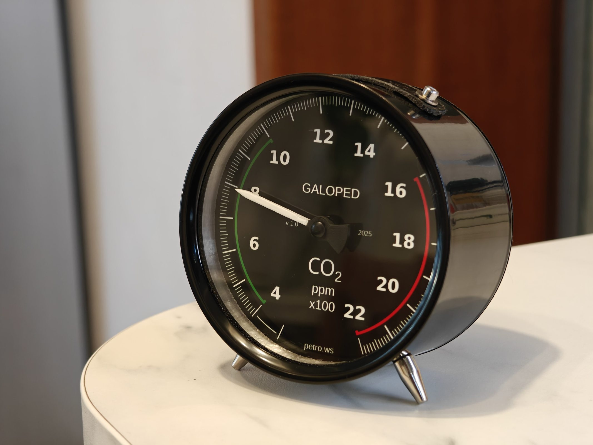
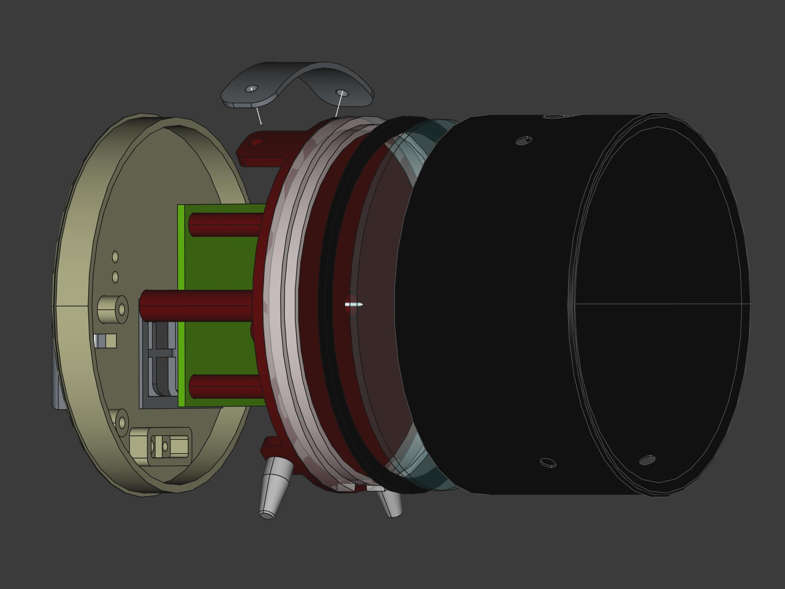
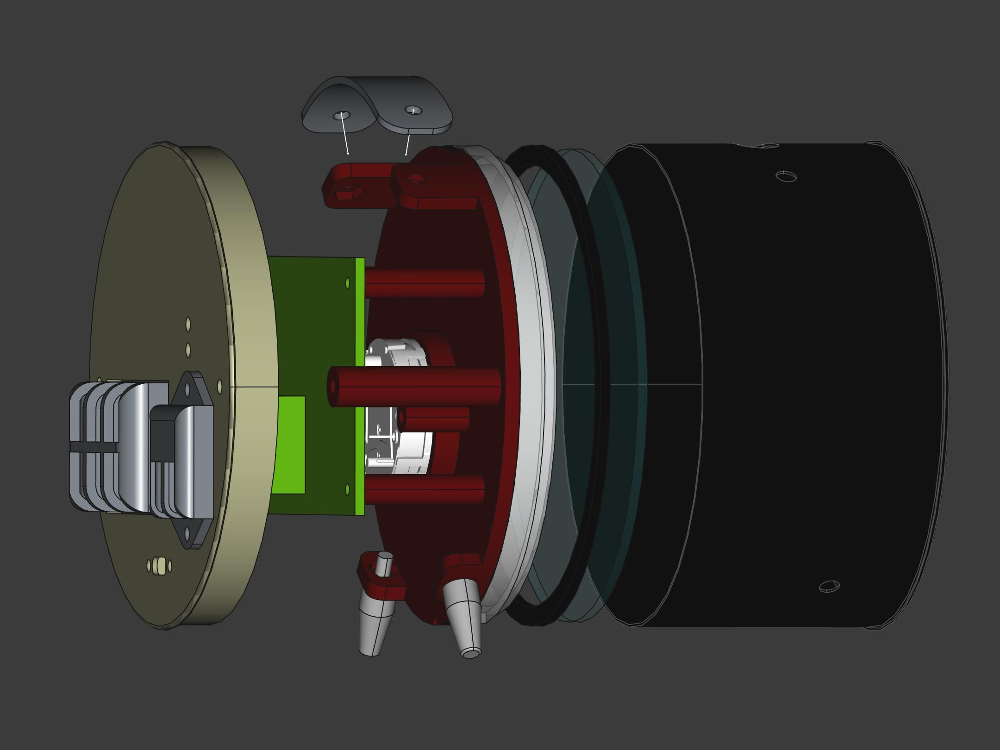
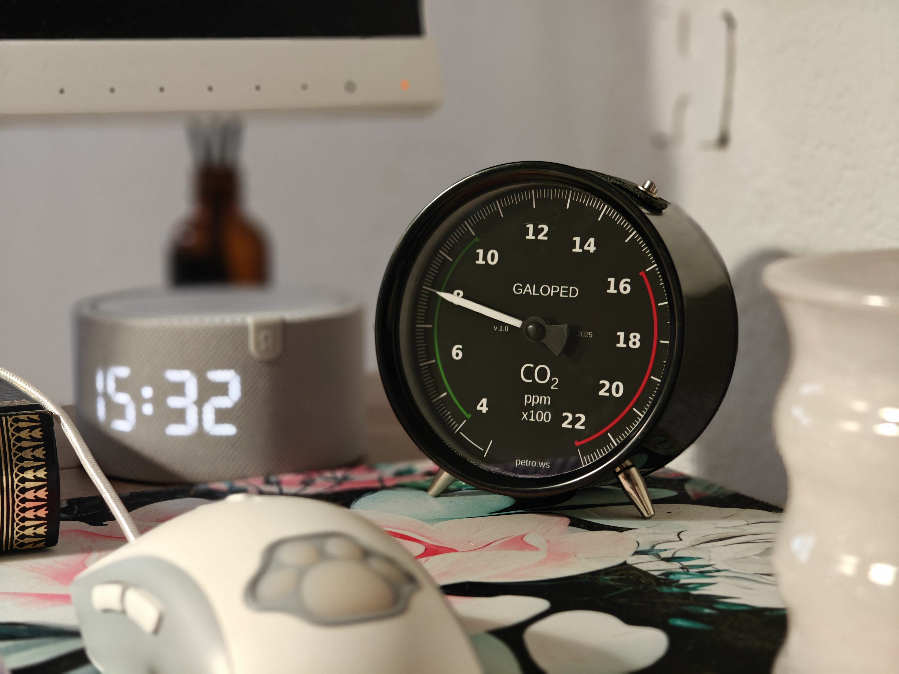
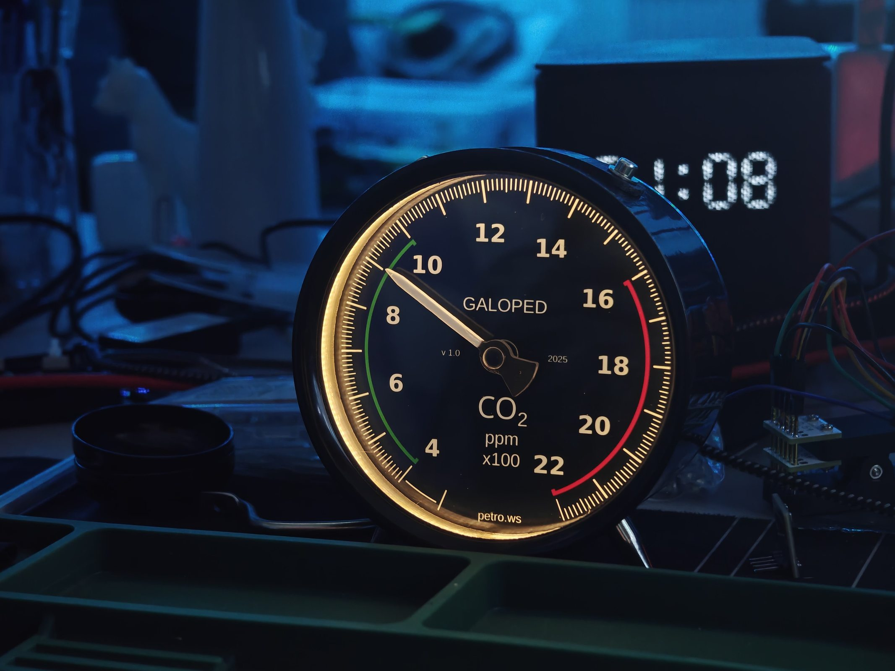
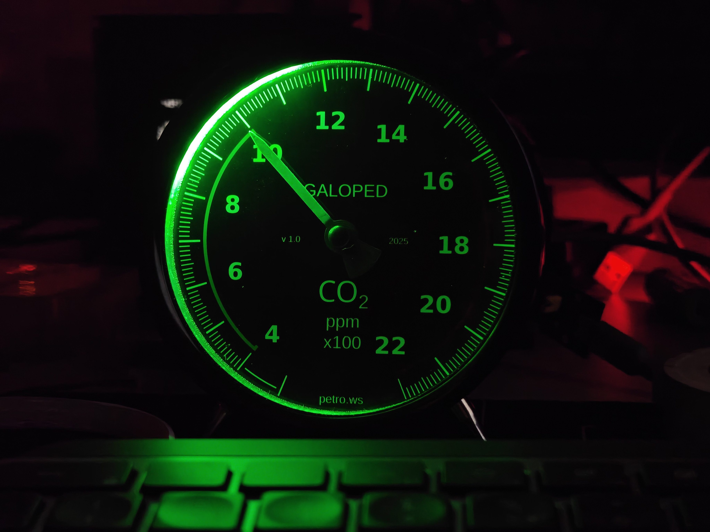
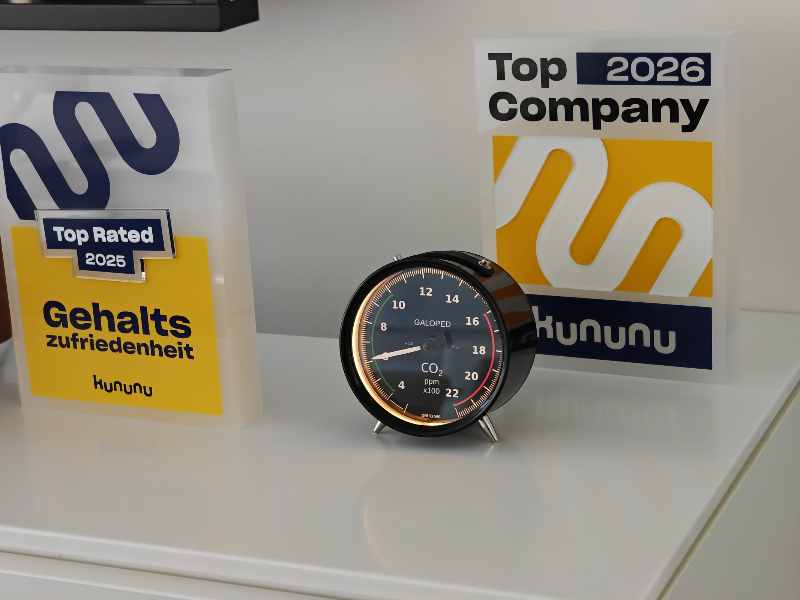
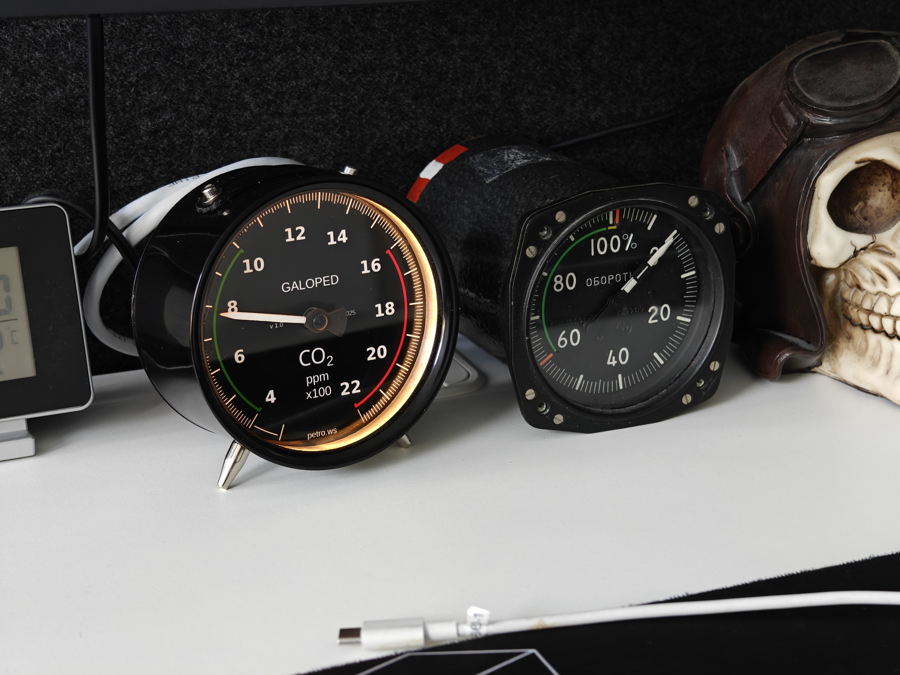

# Galoped-dekad

Smarthome DIY indicator with CO₂ and climate metrics.



This device is a universal desktop indicator with nice exterrior and full open source nature. Based on ESP32-WROOM32E SoC module, VID6608 automotive gauge driver and X27-168 automotive gauge stepper motor.

* Analog indication with needle, resolution is 3840 steps;
* Support to drive 2 motors within included PCB;
* On-board sensors support: SenseAir S8 for Co₂, BMP280+AHTO20 for Temperature, Pressure and Humidity readings;
* WiFi connectivity;
* Backlight: dimmable retro-filament and addressed RGB supported;
* Easy customisation to display anything else, from internal or external data source;
* Designed to run Tasmota directly: WebUI, MQTT, Smart-home integration and etc;

## Device components

This repo contains full sources for this device:

* [CAD and STL models for device enclosure](case)
* [Datasheets for all components used](datasheet)
* [Firmare sources and configuration](firmware)
* [Gauge graphics](gauge)
* [Device schematics](schematic)
* [User manual](manual)

External components:

* Metal enclosure and glass is taken from [Ikea Dekad](https://www.ikea.com/de/de/p/dekad-wecker-schwarz-30540479/)

## Firmware

Contains in two parts:
* Firmware binary (tasmota based)
* The `autoexec.be` script, to connect CO₂ and Gauge, needs to be uploaded using built-in file manager

Download actual version at [Releases](https://github.com/petrows/smarthome-galoped-dekad/releases) page.

Scripts are in [firmware configuration files](firmware).

## Tasmota configuration

Device PCB has following connections to ESP32 MCU:

| GPIO | Configuration |
| ---- | ------------- |
| 0 | Button (also connected to on-board reset curcut) |
| 1 | Exposed UART TX |
| 3 | Exposed UART RX |
| 4 | Exposed to user |
| 13 | Exposed to user |
| 14 | PWM for retro backlight |
| 15 | WS2812b control for RGB backlight |
| 16 | S8 RX |
| 17 | S8 TX |
| 18 | Exposed to user |
| 19 | S8 calibration pin |
| 21 | I²C SDA |
| 22 | I²C SCL |
| 23 | Exposed to user |
| 25 | Exposed to user |
| 26 | Motor A step |
| 27 | Motor A direction |
| 32 | Motor B step |
| 33 | Motor B direction |
| 34 | Button 0 |

Template for RGB backlight version:
```json
{"NAME":"Galoped-dekad-rgb","GPIO":[1,1,1,1,1,1,1,1,1,1,0,1376,1600,1632,1,1,0,640,608,1,0,1,12160,12192,0,0,0,0,1,1,32,1,1,0,0,1],"FLAG":0,"BASE":1}
```

Template for Retro backlight version:
```json
{"NAME":"Galoped-dekad-retro","GPIO":[1,1,1,1,1,1,1,1,1,1,416,0,1600,1632,1,1,0,640,608,1,0,1,12160,12192,0,0,0,0,1,1,32,1,1,0,0,1],"FLAG":0,"BASE":1}
```

See predefined templates in [firmware configuration files](firmware).

## Device strucutre

Physical parts are designed in FreeCAD and provided as-is with STL files to print:





## Assembly

See: [Assembly instructions](doc/assembly.md).

## Gallery










