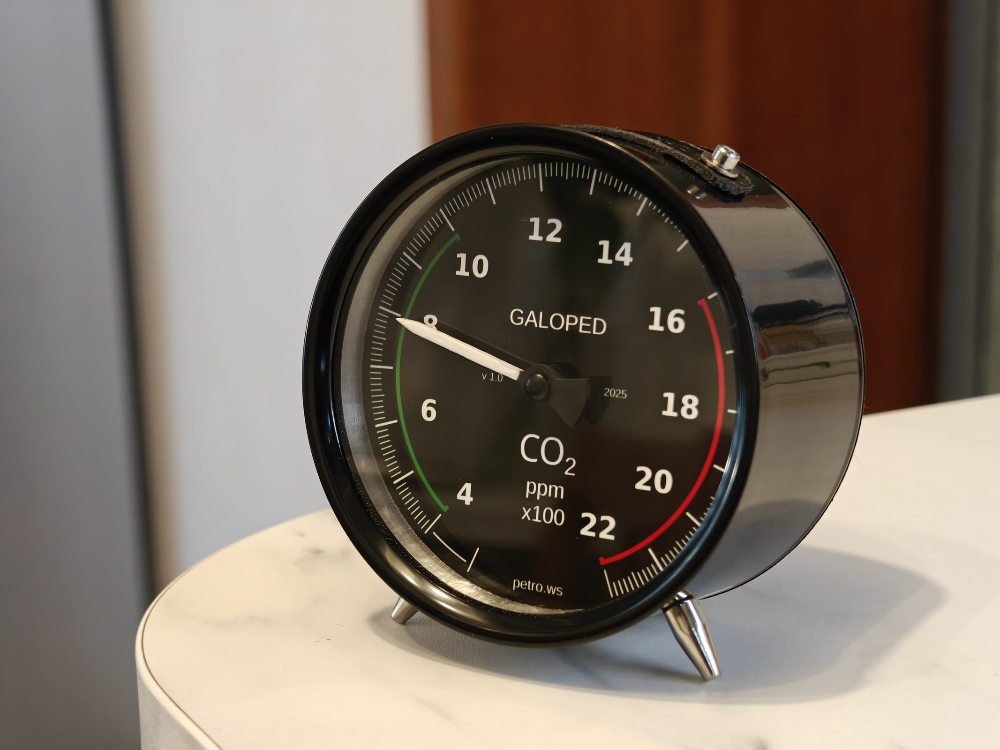
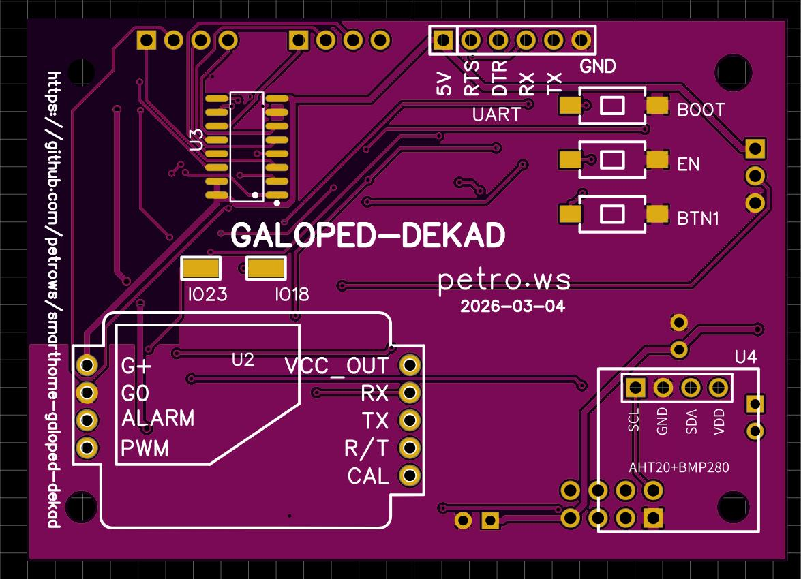
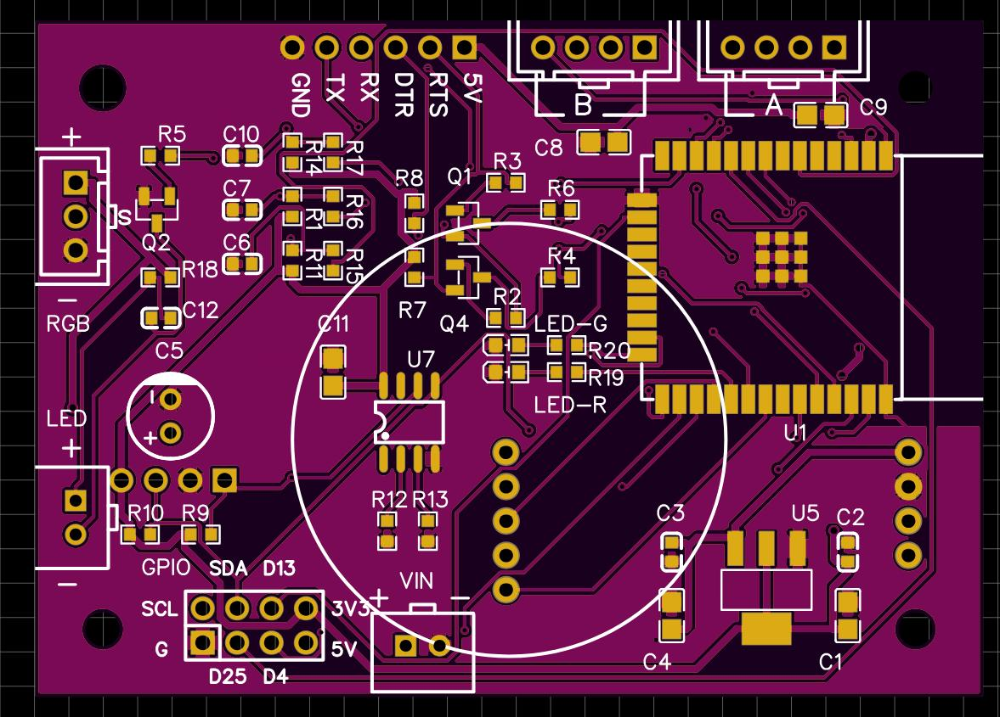
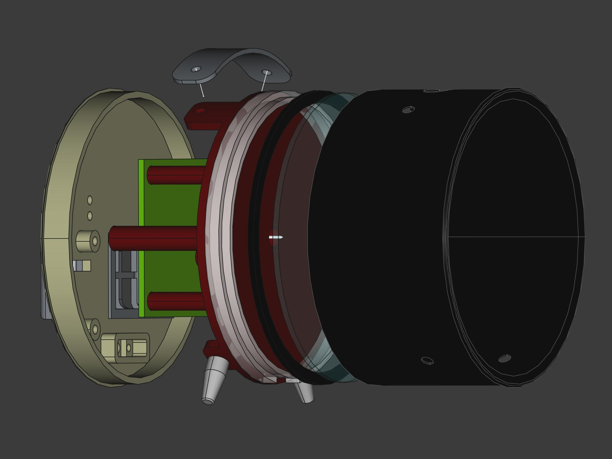
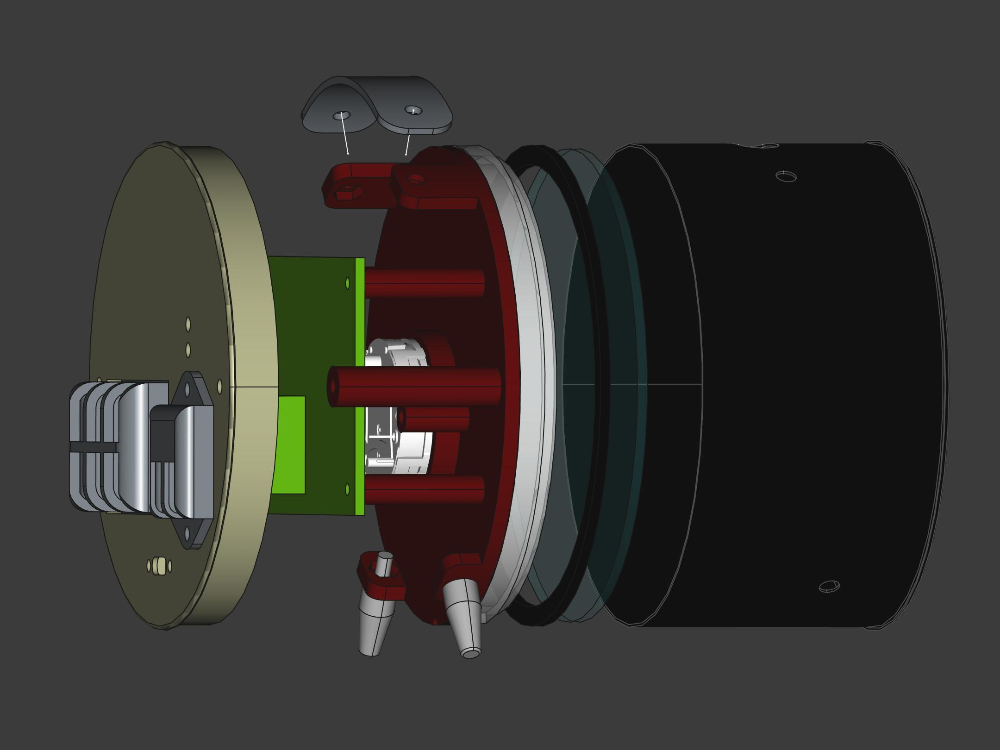

# Galoped-dekad

Vintage analog indicator with modern MCU and Tasmota.

This device is a universal desktop indicator with nice exterrior and full open source nature. Based on ESP32-WROOM32E SoC module, VID6608 automotive gauge driver and X27-168 automotive gauge stepper motor.

* Analog indication with needle, resolution is 3840 steps;
* Support to drive 2 motors within included PCB;
* On-board sensors support: SenseAir S8 for Co₂, BMP280+AHTO20 for Temperature, Pressure and Humidity readings and many others;
* WiFi connectivity;
* Backlight: dimmable retro-filament and addressed RGB supported;
* Easy customisation to display anything else, from internal or external data source;
* Designed to run Tasmota directly: WebUI, MQTT, Smart-home integration and etc;
* 3D Printers status readings (i.e. temperature and progress) and display - for BambuLab and Octoprint;

## Buy device

I have some devices available on Etsy: https://www.etsy.com/de-en/shop/PetroWSDE

## Device variants

Device has several veriants built:

* [CO2 and Cliamte instrument](doc/device-co2.md)
* [3D Printer temperature + progress](doc/device-3dp.md)

## Changelog

* Device version 1: [Version-1 history branch](https://github.com/petrows/smarthome-galoped-dekad/tree/Version-1)
* Device version 2: This readme

### Changes in Version 2:

* Complete new case parts with optimized design:
    * Backlight and main part are assembled before case installation (significally reduces assembly effort)
    * Improved structure stability
* Only one PCB for now is required, drive enclosure is part of case for now
* Fixed design issues for PCB (missing pulldown resistors, connectors redesign)
* New USB-C power socket with USB-C-C cables support
* Complete rework of RGB backlight, removed LED artifacts and glare
* Complete firmware rework (autoexec.bat is not required anymore, fully integrated logic and UI)

## Project information

* [How to configure device](doc/fw-config.md)
* [How to command device](doc/fw-command.md)

## Device components

This repo contains full sources for this device:

* [CAD and STL models for device enclosure](case)
* [Datasheets for all components used](datasheet)
* [Firmare sources and configuration](firmware)
* [Gauge graphics](gauge)
* [Device schematics](schematic)

### External components

* Metal enclosure and glass is taken from [Ikea Dekad](https://www.ikea.com/de/de/p/dekad-wecker-schwarz-30540479/)

### Backlight

* Retro backlight version: 3V flexible LED filament strip (300mm)
* RGB baklight version: 252 mm (40 LED's) of 2.7 mm WS2812b addressed led strip

I dont assembly Retro backlight version by default anymore. RGB Backlight looks and works better for now in version 2.

## PCB and Schematics

Made in EasyEDA Web project:

* [MCU board](https://oshwlab.com/petrows/galoped-dekad)

## Firmware

Firmware is based on [Tasmota](https://tasmota.github.io) with many features included.

Download actual version at [Releases](https://github.com/petrows/smarthome-galoped-dekad/releases) page.

Device configuration: [Galoped firmware configuration](doc/fw-config.md).

Scripts are in [firmware configuration files](firmware).

## Device strucutre

Physical parts are designed in FreeCAD and provided as-is with STL files to print:

## Assembly

See: [Assembly instructions](doc/assembly.md).
