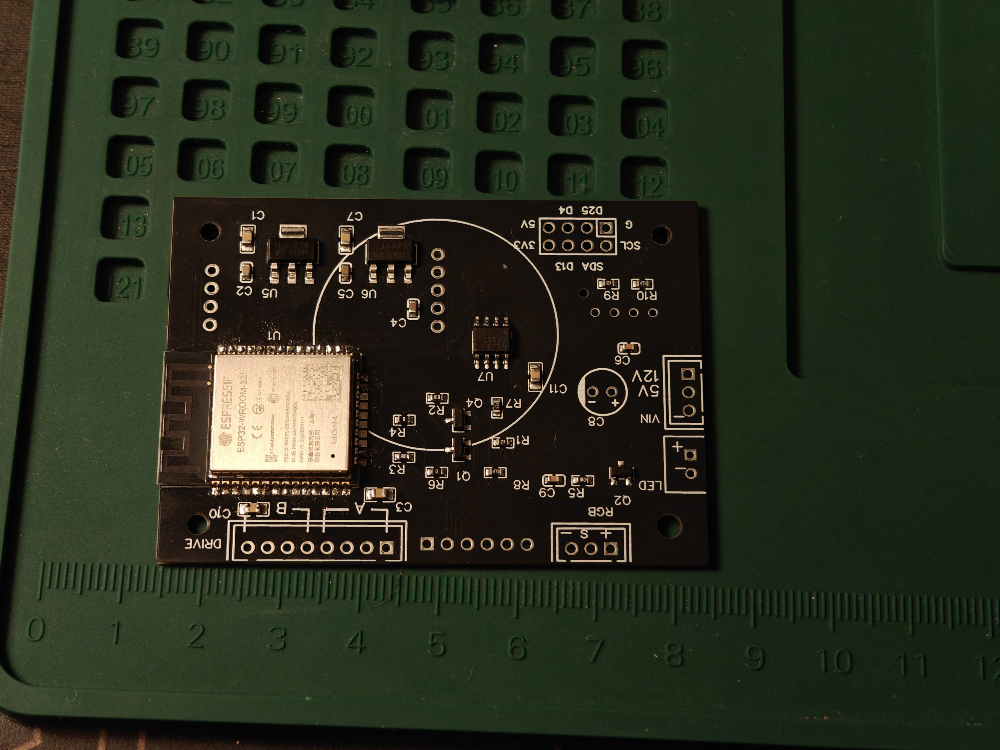
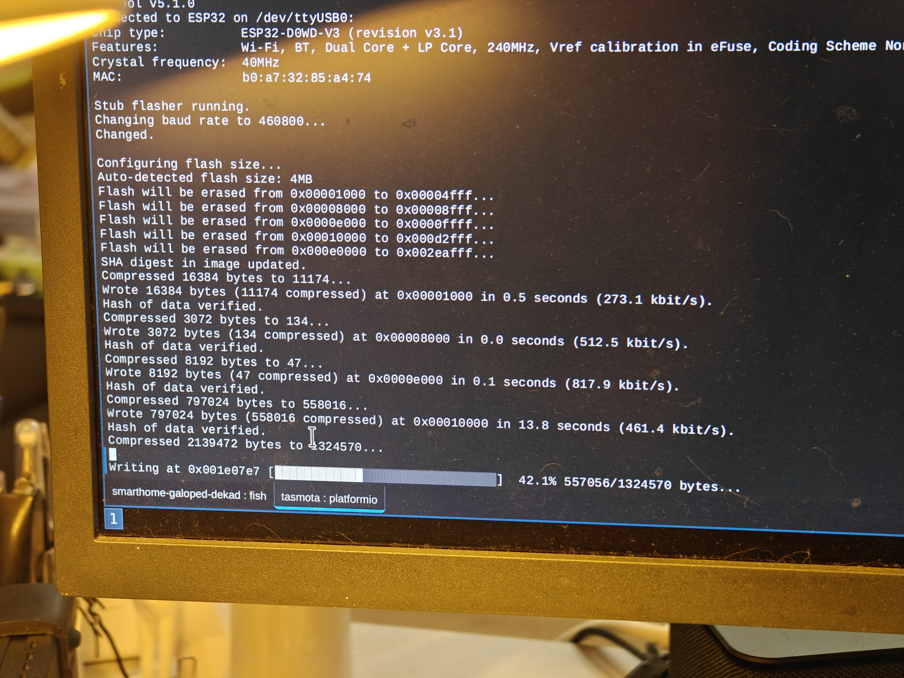
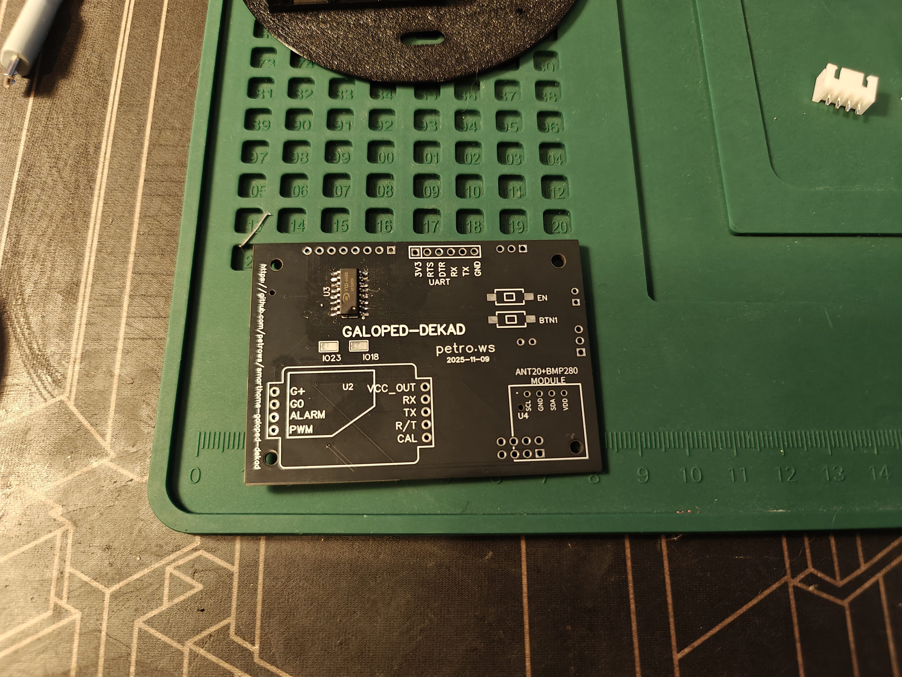
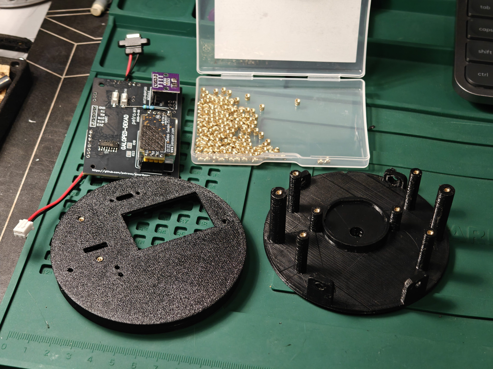
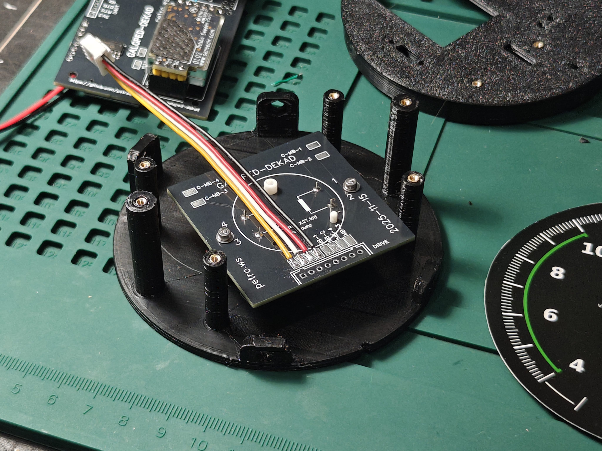
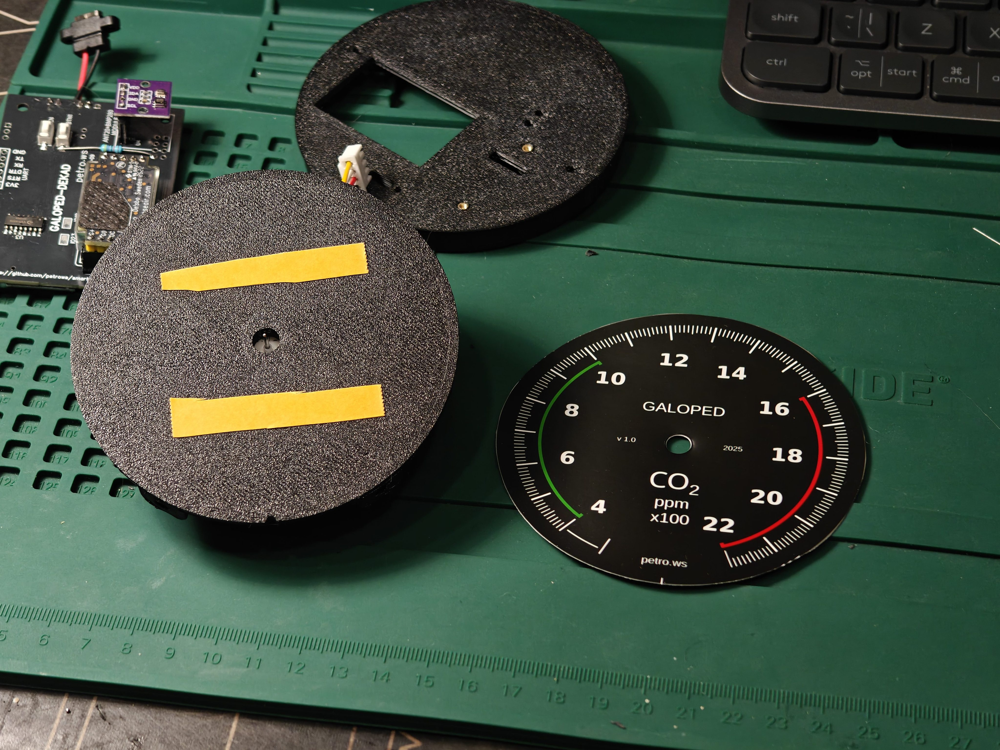
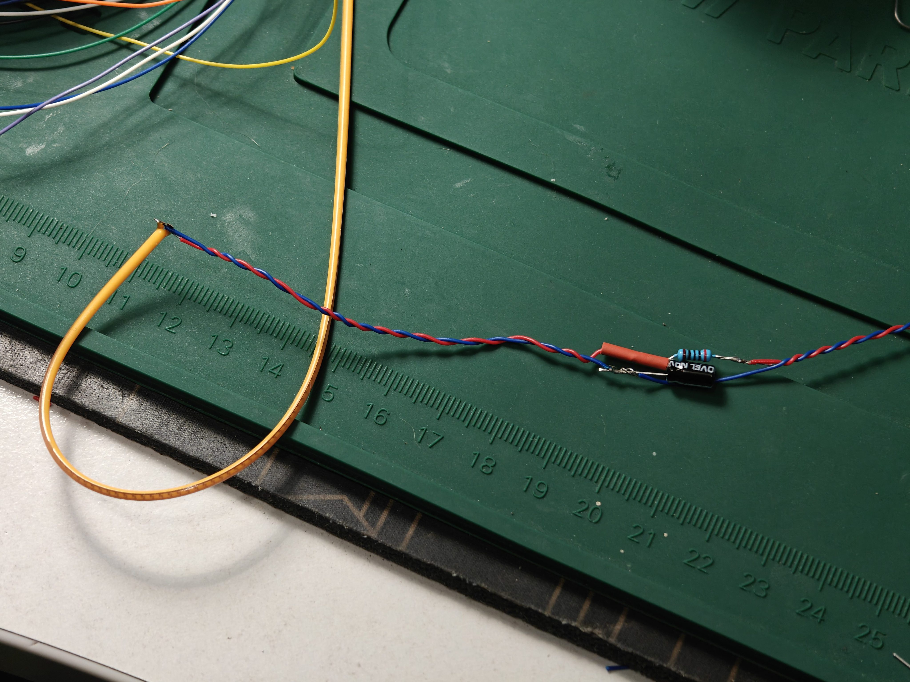
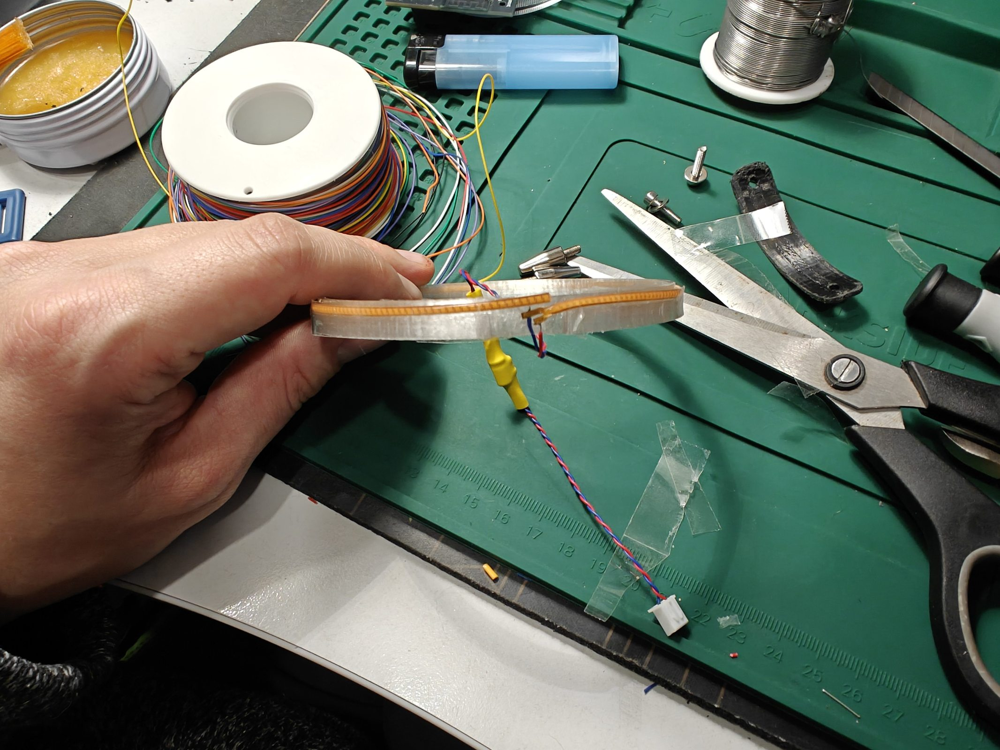
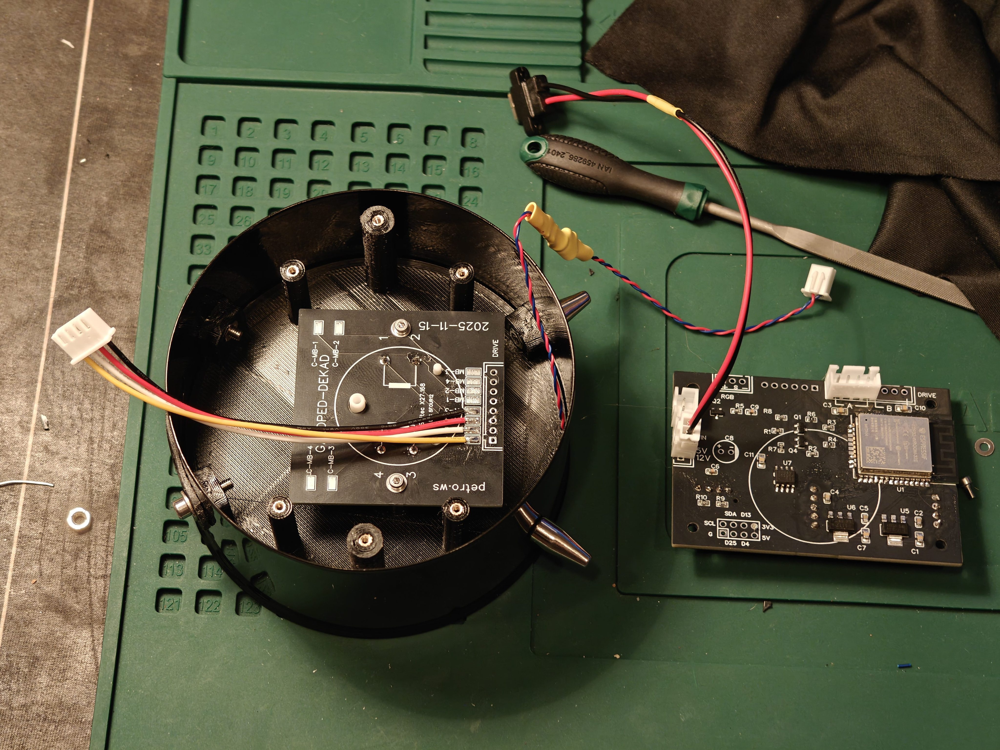
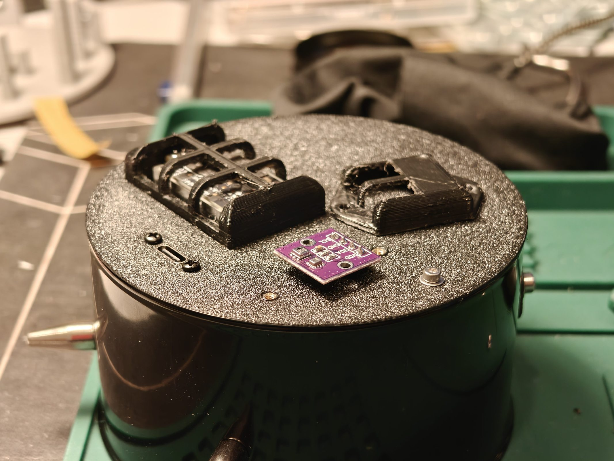

# Assembly

So, let's now connect everything together! Finally we'll see what kind of Frankenstein we've got here. We choose a configuration for assembly: Aviation style, lamp backlight, both sensors installed.

For assembly we should already have all the parts that remained from previous steps or findings. Or just print new ones on 3D and 2D printers, order boards, connectors, wires. We lay all this out on the table and admire. For assembly we generally need the following:

- IKEA DEKAD alarm clock
- Printed parts: front and back covers, top cover, CO₂ and climate sensor covers, two backlight frame parts
- Fasteners: M3 screws (2 pcs), M2 screws (10 pcs), Heat-set inserts for plastic M2 (10 pcs)
- [Filament backlight strip](https://www.aliexpress.com/item/1005009437951627.html) (26 cm or longer) and wires for it
- Printed circuit boards: main and motor
- [X27-168 motor](https://www.aliexpress.com/item/1005008385301163.html), leads on back side
- [ESP32-WROOM32E module (4Mb)](https://www.aliexpress.com/item/1005002515949841.html)
- [VID6608 chip](https://www.aliexpress.com/item/1005007050530920.html)
- [SenseAir S8 sensor](https://www.aliexpress.com/item/1005009122286447.html)
- [Climate sensor - AHT20 / BMP280 module](https://www.aliexpress.com/item/1005005486181411.html)
- [SMD buttons 3x6](https://www.aliexpress.com/item/1005009645342892.html), any height - I have 4.5 mm
- [JST-PH 2.54 connectors](https://www.aliexpress.com/item/1005008339053787.html) and wires: 2-pin (2 pcs), 4-pin (1 pc). I'm too lazy to crimp, got pre-crimped
- [USB-C power connector](https://www.aliexpress.com/item/1005010142667928.html)
- Wires, pin headers, soldering iron, good mood and determination :)

First of all we install the ESP32 chip. I ordered without installation of it, because I had them and didn't want to risk possible defects. Then I cursed everything - installation is a brutal hassle, I ruined one module. Order installation at the factory together with the board - it will be the same price and much less hassle.

Immediately after installation it's important to check operability - flash the firmware and check that the device comes to consciousness. You can flash any Tasmota, then we'll flash what's needed over the air. I use [this adapter](https://www.aliexpress.com/item/1005008554998627.html), it has the needed RST and DTR outputs (note that DTR is brought out on the side header - I was stupid at first and confused it with CTS and ruined one board, thinking I did something improper). In this case the chip flashes directly through esptool or platform.io. If you don't have such an adapter, then any will do, main thing is it's compatible with 3.3V, short the contacts to enter flash mode manually then. It's better to supply external power - 3.3V in my version of the debug connector from the adapter was enough for flashing, but not enough for first boot anymore. In your board version this problem is solved (5V is brought out), but in any case external power is recommended - just in case. In this case connect only ground from the adapter, otherwise you can burn something.

Hooray! Seems we didn't ruin anything. Yet :)

We solder the rest - connectors and actually our hero of the day - VID6608. It's much easier to install than ESP32, harder to mess up. Be sure to check pins after installation! Everything looked super for me, but half the pins actually weren't making contact. If poorly soldered it will look like this: the drive will jerk chaotically instead of smooth movement. We install everything else - button connectors and such.

We install sleeves for M2 screws. Installation is very simple - place on the hole and press in with soldering iron, everything turns out even and beautiful.

We solder our motor to the mounting board and put a connector. Holes for the header can be drilled out and push wires through there for better retention.

After installing the drive we can cut out and glue the front panel. We prepare the needle, press the tip into it and paint. After this we can assemble everything together.

At this stage it's important to set the needle exactly to zero. For this we pull the needle on as we can (it goes on very tight, don't be shy), then rotate the motor to the stop (without signal it rotates freely) to zero and carefully rotate the needle until it's exactly at the beginning of the dead zone, this is the true zero of the scale.

We disassemble the alarm clock, remove everything valuable from it, remove the sticker and clean. We get a beautiful glossy cylinder. We carefully remove the glass and preferably don't smudge it - greasy fingerprints will be hard to remove later.

We prepare the filament strip - solder to the leads at right angles and make a connector. I also have a correction circuit soldered: 220 Ohm resistor and ripple suppression capacitor. In the board version you'll see in EasyEDA these parts are already installed (at the time of creating the very first version I was still in doubt about the backlighting).

We install the strip in the frame, it's best to turn it with the "matte" part inward. For convenience you can glue with transparent tape. Also put a bit of tape between the contact petals for insulation, there's no room to properly fit in heat shrink. We trim the strip so it meets evenly - then we'll have minimal dark piece of backlighting.

We insert the glass, black frame and our frame with strip into the case. It's important to put in correct orientation - parts are made to enter tight fit (so nothing rattles) and rotating later can be difficult. Wires should exit exactly at the bottom center to get into the cutout of the main part.

We install the main case part, pass backlight wires through. Now we can screw in our main fastening lines: feet and M3 screws through the top cover.

We connect all connectors and install the main board, orient it with sensors down. We screw everything with beautiful M2 screws.

In the back cover we screw the USB-C connector on small screws, pushing it from inside. You can use original silver IKEA ones from the alarm clock, but I have anodized black ones, they look better. We install the S8 sensor grille, the sensor itself and place the cover in place, screw everything on two M2 screws.

Our climate sensor turns out sticking out of the case. This is good - then heat from the MCU won't affect its readings.

We poke our climate sensor on the connector and screw the cover on top with two more M2 screws. Assembly complete :-)

We move to arm's length distance, turn on and check that everything works. Note that without initial configuration the device won't even call calibration "out of the box", we need to configure Tasmota and prepare the unit for work.

Assembly done.
