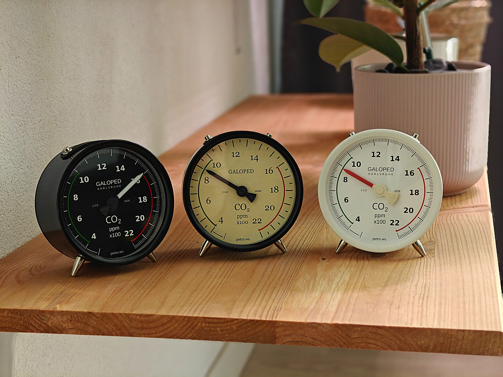
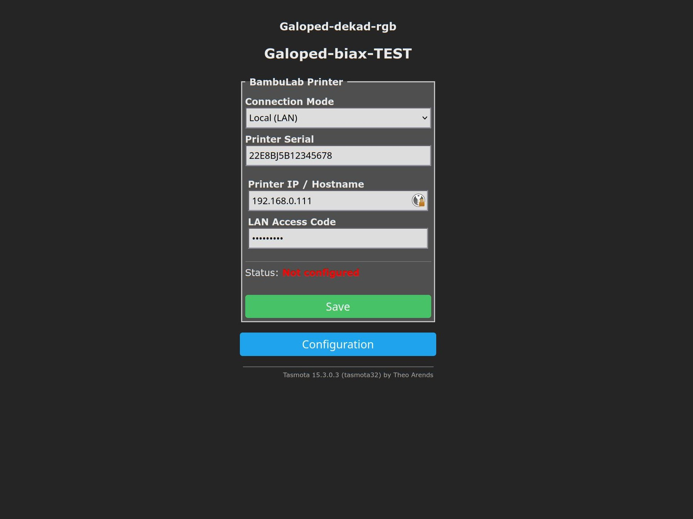
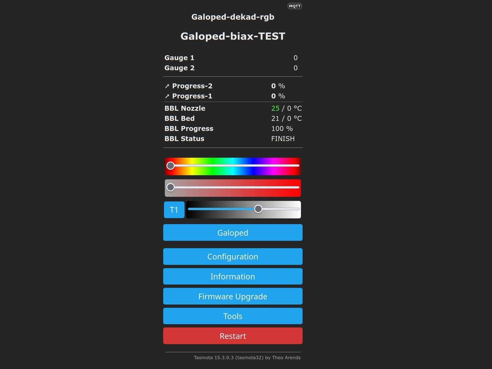

# Galoped (3D Printer version)



## Device specs

Device has customizations on top of base Galoped model:

* Device does not have any customization
* Sensors are not installed

## Configuration

Configuration for devices:

### Printer Temperature + Progress (Bi-Axial)

```ini
; galoped.ini
; Printer Temperature + Progress (Bi-Axial)
[galoped]
model = 3dp_tp
[gauge-1]
name = Temp
unit = C°
deg = 270
min = 0
max = 300
[gauge-2]
name = Progress
unit = %
deg = 270
min = 0
max = 100
```

## BambuLab printer status display

Firmware has module to read MQTT status report from BambuLab printers. To connect
such printer to gauge, you need to enable LAM mode and get Access key and know printer
address in LAN.

* [Enable developer mode in your printer](https://wiki.bambulab.com/en/knowledge-sharing/enable-developer-mode)
* Write down printer IP Address inside your home network
* Write down serial number of your printer

When done, you can configure Galoped's firmware to read data:

* Navigate to **Configuration** -> **Configure BambuLab**
* Enter required fields:
    * `Printer serial` - Serial number of your printer
    * `Printer IP` - Address of your printer in home network
    * `LAN Access code` - Access code for your printer



After configuration, please wait a few minutes, when data is read from printer,
you will see status at the index page:



## Octoprint printer status display

Octoprint can be integrated using various ways.

Recommended option is to use common MQTT brocker and in this case you can configure Octoprint as follows:

```bash
# This command drives Gauge 1 to position 77%

mosquitto_pub -h <broker-ip> -u <username> -P <password> -t 'cmnd/galoped_ABCDEF/GalopedSet1' -m '77'
```

